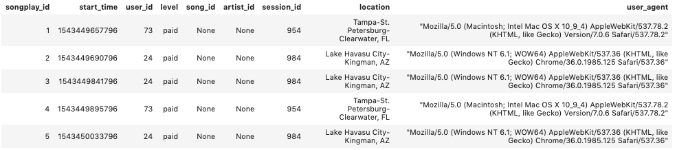
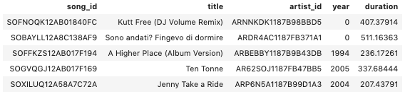
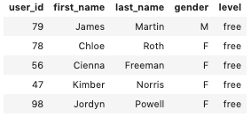
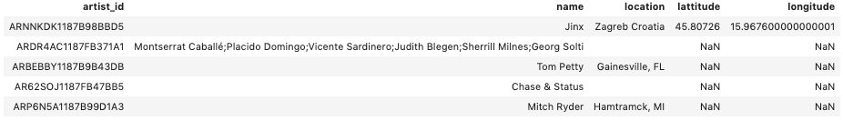
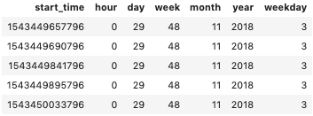

# Project Summary

### Background
This project is to help a startup called <strong>Sparkify</strong> to understand what songs users are listening to. Sparkify has been collecting on songs and user activity on their new music streaming app. 

### Datasets
<ol>
    <li><strong>Song Dataset</strong></li>
    > Each file is in JSON format and contains metadata about a song and the artist of that song.  
    > File names are like 'song_data/A/B/C/TRABCEI128F424C983.json' etc.  
    > In each file, data are like: {"num_songs": 1, "artist_id": "ARJIE2Y1187B994AB7", "artist_latitude": null, "artist_longitude": null, "artist_location": "", "artist_name": "Line Renaud", "song_id": "SOUPIRU12A6D4FA1E1", "title": "Der Kleine Dompfaff", "duration": 152.92036, "year": 0}
    <li><strong>Log Dataset</strong></li>
    > Each file is in JSON format and contains logs on user activity on the app  
    > File names are like 'log_data/2018/11/2018-11-12-events.json' etc.  
    > below is an example of what the data in a log file, 2018-11-12-events.json, looks like.
</ol>

    

### Tasks
<ol>
    <li><strong>data modeling</strong> with <em>PostgreSQL</em></li>
    > define fact and dimension tables for a star schema 
    > fact table: songplays 
    > dimension tables: users, songs, artists, time
    <li><strong>buidling ETL pipeline</strong> with <em>Python</em></li>
    > write an ETL pipeline that transfers data from files in two local directories into these tables above in Postgres  
    > get and read song and log files and insert records into fact and dimension tables 
    > user table has duplicates that same user_id having different level (free/paid), used ON CONFLICT DO UPDATE to leave the unique records
</ol>

---
# To run the Python scripts
<ol>
    <li>Click <em>File -> New -> Console</em> at top menu bar</li>
    <li>Select kernel <em>Python3</em></li>
    <li>Type <code>'%run create_tables.py'<\code> in the console cell</li>
    <li>Click <em>Run -> Run selected cell</em> at top menu bar</li>
    <li>Type <code>'%run etl.py'<\code> in the console cell</li>
    <li>Click <em>Run -> Run selected cell</em> at top menu bar</li>
</ol>

        
---
# Files in the repository
In addition to the data files, the project workspace includes six files:
<ul>
    <li><strong><em>test.ipynb</em></strong> displays the first few rows of each table to check database.</li>
    <li><strong><em>create_tables.py</em></strong> drops and creates tables.</li>
    <li><strong><em>etl.ipynb</em></strong> reads and processes a single file from song_data and log_data and loads the data into tables.</li>
    <li><strong><em>etl.py</em></strong> reads and processes files from song_data and log_data and loads them into tables.</li>
    <li><strong><em>sql_queries.py</em></strong> contains all sql queries, and is imported into the last three files above.</li>
    <li><strong><em>README.md</em></strong> this file provides discussion on the project.</li>
</ul>
        

---
# Results

1. songplays table

2. songs table

     

3. users table

4. artists table

5. time table

